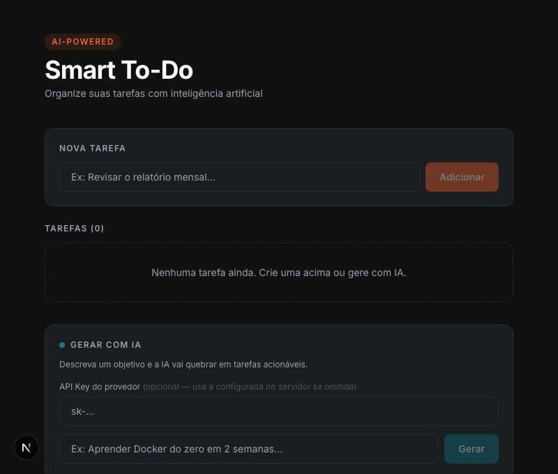

# Smart To-Do — AI-Powered Task Manager

Aplicação full-stack de gerenciamento de tarefas com geração automática via LLM a partir de objetivos em linguagem natural.



---

## Stack

| Camada | Tecnologia |
|---|---|
| Backend | NestJS + TypeScript |
| Banco de dados | SQLite via TypeORM |
| Frontend | Next.js 15 + TypeScript + Tailwind |
| AI | OpenRouter (modelos gratuitos) |
| Infra | Docker + docker-compose |

---

## Como rodar localmente

### Pré-requisitos

- Node.js **v20+** (recomendado: via [nvm](https://github.com/nvm-sh/nvm))
- npm

### 1. Clone e configure o ambiente

```bash
git clone <url-do-repo>
cd project-test
```

Crie o `.env` na raiz do projeto:

```bash
cp .env.example .env
```

Edite o `.env` com suas configurações:

```env
# Opção A — usar IA real (OpenRouter, gratuito)
AI_API_KEY=sk-or-v1-...        # obtenha em openrouter.ai
AI_BASE_URL=https://openrouter.ai/api/v1
AI_MODEL=google/gemma-3-12b-it:free
AI_MOCK=false

# Opção B — modo mock (sem chave, tarefas geradas localmente)
AI_API_KEY=
AI_BASE_URL=
AI_MODEL=
AI_MOCK=true
```

> Para obter uma chave gratuita: acesse [openrouter.ai](https://openrouter.ai), crie uma conta e gere uma API Key. Os modelos `:free` não consomem créditos.

---

### 2. Iniciar o backend

```bash
cd backend
npm install
export $(cat ../.env | xargs)   # carrega as variáveis de ambiente
npm run start:dev
```

Backend disponível em:
- API: `http://localhost:3000`
- Swagger: `http://localhost:3000/api`

---

### 3. Iniciar o frontend

Em outro terminal:

```bash
cd frontend
npm install
npm run dev
```

Frontend disponível em: `http://localhost:3001`

---

### 4. Rodar os testes

```bash
cd backend
npm test
```

Saída esperada: **14 testes passando** (TaskService + AiService).

---

## Como usar

1. Acesse `http://localhost:3001`
2. **Nova tarefa** — adicione tarefas manualmente pelo campo superior
3. **Gerar com IA** — descreva um objetivo (ex: "Aprender Docker do zero") e clique em **Gerar**
   - O campo "API Key do provedor" é opcional: se deixado em branco, usa a chave do `.env`
4. Marque tarefas como concluídas clicando no checkbox; remova passando o mouse e clicando em "remover"

---

## Execução com Docker

```bash
# na raiz do projeto (lê o .env automaticamente)
docker compose up --build
```

| Serviço | URL |
|---|---|
| Frontend | http://localhost:3001 |
| Backend | http://localhost:3000 |
| Swagger | http://localhost:3000/api |

---

## Endpoints da API

| Método | Rota | Descrição |
|---|---|---|
| `GET` | `/tasks` | Lista todas as tarefas |
| `POST` | `/tasks` | Cria uma tarefa manualmente |
| `PATCH` | `/tasks/:id` | Atualiza título ou status |
| `DELETE` | `/tasks/:id` | Remove uma tarefa |
| `POST` | `/tasks/generate` | Gera tarefas via IA a partir de um objetivo |

O endpoint `/tasks/generate` aceita o header opcional `x-api-key` para sobrescrever a chave configurada no servidor.

---

## Decisões técnicas e trade-offs

### TypeORM + better-sqlite3 em vez de Prisma

Prisma v7 introduziu uma arquitetura incompatível com NestJS sem configuração extra significativa (datasource sem `url`, cliente gerado em ESM com `@ts-nocheck`). TypeORM integra nativamente via `@nestjs/typeorm` com `synchronize: true` para desenvolvimento ágil.

**Trade-off:** `synchronize: true` recria colunas automaticamente. Em produção seria substituído por migrations versionadas.

---

### OpenRouter como provider de IA

O cliente usa o SDK da OpenAI com `baseURL` configurável, o que torna o código agnóstico ao provider. OpenRouter oferece modelos gratuitos (sufixo `:free`) sem necessidade de cartão de crédito.

**Trade-off:** modelos gratuitos têm limites de rate e podem não suportar todos os recursos (ex: `response_format: json_object`). O serviço detecta isso via `supportsJsonMode()` e usa prompt engineering como fallback.

---

### Mensagem única (sem role `system`)

Modelos como Gemma via OpenRouter retornam erro 400 quando o campo `system` está presente. A instrução foi mesclada na mensagem `user` para garantir compatibilidade com qualquer provider OpenAI-compatible.

---

### AI_MOCK=true para desenvolvimento sem créditos

O `AiService` verifica `AI_MOCK` antes de chamar a API e retorna tarefas geradas localmente. Permite desenvolver e demonstrar a feature sem depender de chave válida.

---

### Jest 30 + Babel em vez de ts-jest

Jest 30 (instalado pelo NestJS CLI) quebrou a resolução de transforms — `ts-jest` não é localizado pelo novo resolver. A alternativa funcional foi `babel-jest` + `babel-plugin-transform-typescript-metadata` para suporte a decorators TypeORM.

**Trade-off:** Babel não faz checagem de tipos nos testes. Erros de tipo são capturados pelo `tsc` no build.

---

### Frontend: useState sem biblioteca de estado

A aplicação tem um único recurso e uma única página. Introduzir Redux, Zustand ou React Query seria over-engineering. Cada mutação dispara um `GET /tasks` para manter o estado sincronizado com o servidor.

---

## Estrutura do projeto

```
project-test/
├── .env                        # variáveis de ambiente (não commitado)
├── .env.example
├── docker-compose.yml
├── backend/
│   ├── src/
│   │   ├── task/
│   │   │   ├── task.entity.ts
│   │   │   ├── task.service.ts
│   │   │   ├── task.controller.ts
│   │   │   ├── ai.service.ts
│   │   │   ├── task.service.spec.ts
│   │   │   ├── ai.service.spec.ts
│   │   │   └── dto/
│   │   ├── filters/
│   │   │   └── http-exception.filter.ts
│   │   └── main.ts
│   ├── babel.config.js
│   ├── jest.config.js
│   └── Dockerfile
└── frontend/
    ├── app/
    │   ├── page.tsx
    │   ├── layout.tsx
    │   └── globals.css
    ├── lib/
    │   └── api.ts
    └── Dockerfile
```
